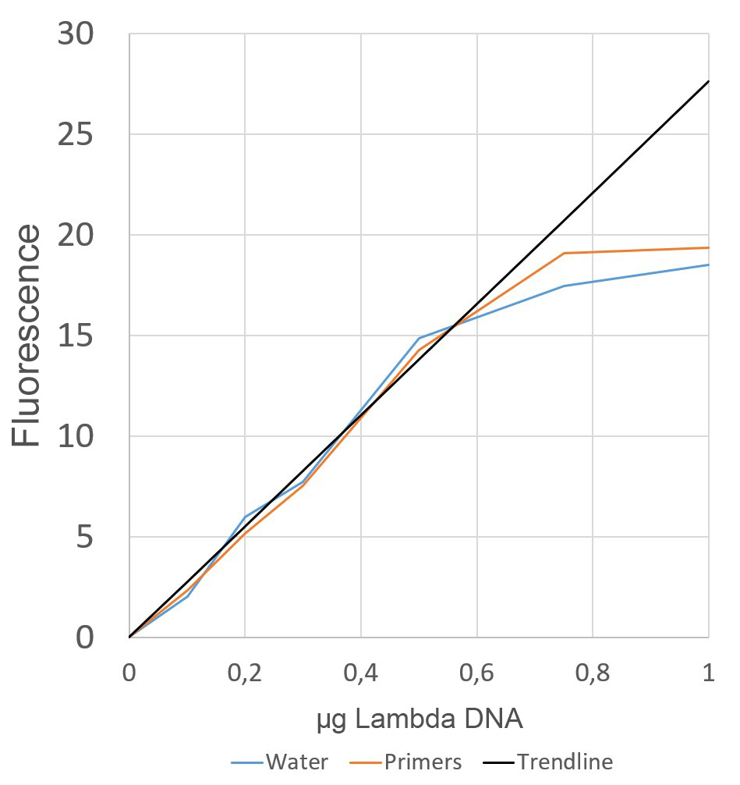
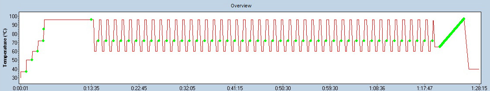
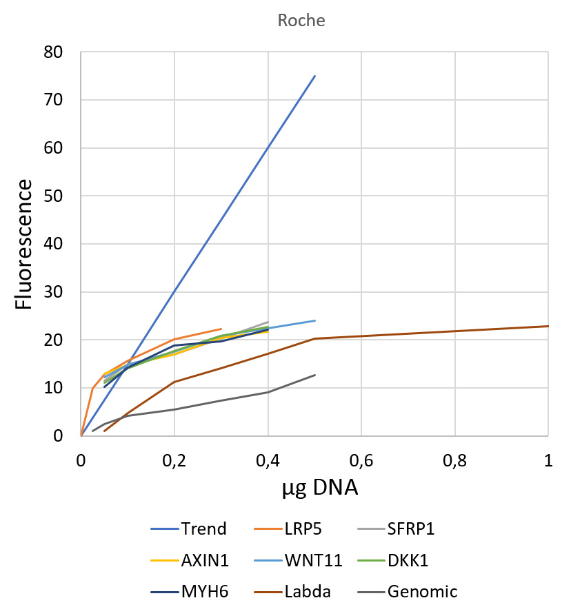
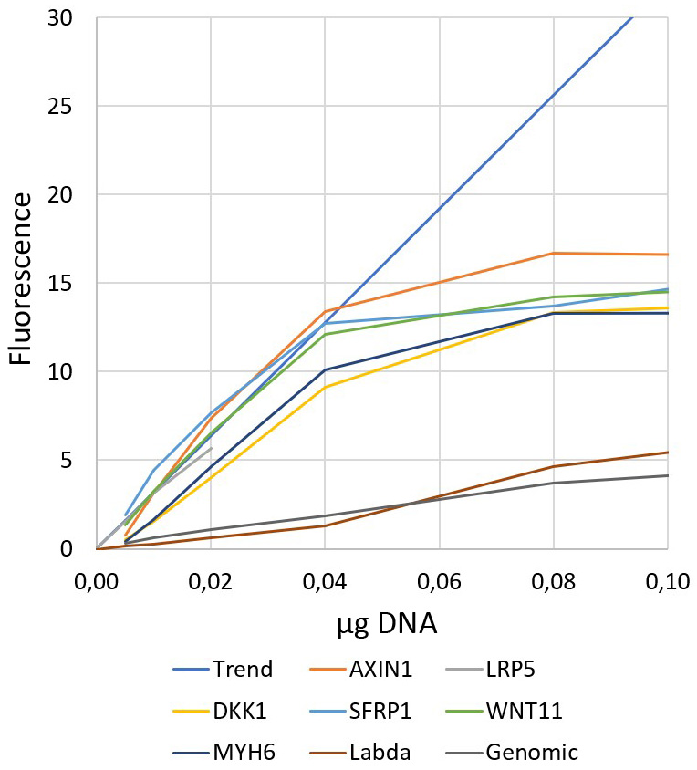

#  Optical Calibrators
This file and the mentioned data are part of the test data set of RDML tools ([Optical Calibrator Data](https://github.com/RDML-consortium/rdmlpython/tree/main/experiments/optical_calibrators)).

The idea of absolute quantification using optical calibrators dates back to early days of qPCR and was proposed by Bob Rutledge ([Nucleic Acids Res. 2004 Dec 15;32(22):e178. doi: 10.1093/nar/gnh177](https://doi.org/10.1093/nar/gnh177)). In principle, a known amount of DNA (around 10ng) results in a constant fluorescence in qPCR in the absence of primers and hence without amplification during qPCR. This constant fluorescence is used to calculate the fluorescence per ng and to quantify the amount of DNA present at the threshold level. From the amount of DNA and the amplification during the qPCR the copy numbers at the start can be calculated. The beauty of this method would be that one optical calibrator could serve as a reference for all targets within the run.

The experiments below were run on a LightCycler 480 II from Roche using the LightCycler 480 SYBR Green I Master Mix from Roche (04887352001) in the Academisch Medisch Centrum (AMC) in Amsterdam, Netherlands. All reactions are performed in 10µl.

## Experiment OC-1 (03.12.2021)
This was an initial test for optical primers. Digested Lambda DNA was added to five different primer sets as well as without primers to investigate if primers have an impact on optical calibration.  

Raw data are available as [experiment_OC_1.rdml](experiment_OC_1.rdml)

The mean fluorescence of the cycles 15-29 was calculated per reaction [experiment_OC_1_mean_fluor.tsv](experiment_OC_1_mean_fluor.tsv) and averaged [experiment_OC_1_results.tsv](experiment_OC_1_results.tsv). There is no obvious difference between the different primer pairs and in the reactions without primers.

The fluorescence is proportional to lambda DNA up to 0.5µg (50ng/µl).

## Experiment OC-2 (03.03.2023)
This experiment compares different reaction mixes and different DNAs without any primers present. Lambda, Genomic DNA and PCR amplicons of different length and properties were used:

|Mix       | Columns | Order Information                                              |
|----------|---------|----------------------------------------------------------------|
|Roche     |    1-8  |LightCycler 480 SYBR Green I Master Mix from Roche (04887352001)|
|SensiFast |   9-16  |SensiFast SYBR No-ROX Mix from bioline (CSA-01190)              |
|LCGreen   |  17-24  |5x LCG PCR Master from the Wittwer Lab                          |

|Amplicon|Length|GC |Tm  |
|--------|------|---|----|
|AXIN1   |  71bp|56%|83.8|
|LRP5    |  73bp|51%|80.6|
|DKK1    | 122bp|76%|93.2|
|SFRP1   | 130bp|33%|75.7|
|WNT11   | 131bp|60%|87.0|
|MYH6    | 382bp|51%|88.9|

In a qPCR run the optical calibrator must melt and hybridize several times. To detect any loss from the first 95°C step, additional measurements were introduced at the start of the qPCR (green dots):

As fluorescence is dependent on temperature, the fluorescence loss at the first 95°C step is calculated by measuring at 72°C in the first 15 cycles, calculate an average and divide it by the fluorescence measured at 72°C before the initial 95°C step. 

Raw data are available as [experiment_OC_2.rdml](experiment_OC_2.rdml) but lack the initial fluorescence measurements which are given in [experiment_OC_2.tsv](experiment_OC_2.tsv).

The average fluorescence, the corrected fluorescence subtracting the background, the fluorescence per input DNA amount and the fluorescence ratio before the 95°C step and the average of the cycles 1-15 were calculated ([experiment_OC_2_analysis.tsv](experiment_OC_2_analysis.tsv)). The fluorescence loss at the first 95°C step is obvious with longer DNA in the Roche mix in low concentrations:

|Amplicon|0.00|0.05|0.10|0.20|0.30|0.40|0.50|1.00|µg DNA|
|--------|----|----|----|----|----|----|----|----|------|
|AXIN1   |    |0.95|0.90|0.86|0.86|0.85|0.90|0.90|      |
|LRP5    |0.88|0.87|0.91|0.88|0.89|0.91|0.90|0.94|      |
|DKK1    |    |0.81|0.91|0.90|0.91|0.90|0.91|0.92|      |
|SFRP1   |    |0.86|0.89|0.89|0.92|0.92|0.89|0.91|      |
|WNT11   |    |0.90|0.88|0.89|0.92|0.93|0.93|0.93|      |
|MYH6    |    |0.80|0.85|0.90|0.99|0.90|0.88|0.95|      |
|Lambda  |0.83|0.19|0.36|0.65|0.72|0.78|0.86|0.93|      |
|Genomic |    |0.18|0.22|0.30|0.31|0.36|0.39|0.51|      |

Lambda DNA and Genomic DNA show 5 times higher fluorescence before the 95°C step then in the cycles after at 0.05µg DNA concentration (see the similar results in the other mixes in [experiment_OC_2_analysis.tsv](experiment_OC_2_analysis.tsv)). This suggests that the complex DNA has difficulties hybridizing efficiently in lower concentrations. The PCR amplicons do not lose fluorescence at this step.

The fluorescence is not proportional to the DNA concentration, suggesting a lower linear range.

## Experiment OC-3 (10.03.2023)
To find the linear range, lower DNA concentrations were evaluated using MYH6.

Raw data are available as [experiment_OC_3.rdml](experiment_OC_3.rdml) but lack the initial fluorescence measurements which are given in [experiment_OC_3.tsv](experiment_OC_3.tsv).

Although the fluorescence is quite proportional to the DNA concentration, there is a loss in fluorescence in the first 95°C step. This suggests that MYH6 is already too long for efficient hybridization in low concentrations. In this run the single copy gene FSTL1 was used for the first time as qPCR reference in combination with genomic DNA.

## Experiment OC-4 (16.03.2023)
All PCR amplicons are evaluated at lower DNA concentrations using the different DNA mixes. The amplicons and the mixes are identical to Experiment OC-2.

Raw data are available as [experiment_OC_4.rdml](experiment_OC_4.rdml) but lack the initial fluorescence measurements which are given in [experiment_OC_4.tsv](experiment_OC_4.tsv).

The mean of the fluorescence in the cycles 1-15 was calculated. Then mean of the two replicates was divided by the mean of the fluorescence before the 95°C step ([experiment_OC_4_hyb.tsv](experiment_OC_4_hyb.tsv)):

|Mix      |µg DNA|AXIN1|LRP5|DKK1|SFRP1|WNT11|MYH6|Lambda|Genomic|
|---------|------|-----|----|----|-----|-----|----|------|-------|
|Roche    | 0.000|     |0.89|    |     |     |    |  0.87|       |
|Roche    | 0.005| 0.50|0.55|0.46| 0.79| 0.56|0.32|  0.24|   0.27|
|Roche    | 0.010| 0.89|0.76|0.68| 1.14| 0.94|0.55|  0.26|   0.37|
|Roche    | 0.020| 1.21|0.98|0.78| 1.13| 1.13|0.72|  0.28|   0.31|
|Roche    | 0.040| 1.95|    |1.41| 2.10| 1.69|1.50|  0.37|   0.44|
|Roche    | 0.080| 1.21|    |1.04| 1.55| 1.46|1.24|  0.72|   0.53|
|Roche    | 0.160| 1.19|    |1.10| 1.16| 1.14|1.13|  0.78|   0.56|

The low DNA concentrations of 0.005 and 0.01 show a loss of fluorescence indicating low efficiency in hybridization in low concentrations. The higher concentrations even show an increase in fluorescence. This could be due to improved binding of limiting SYBR to the DNA following the first melting step. MYH6, Lambda and genomic DNA show a loss of fluorescence at all concentrations indicating low efficiency in hybridization probably due to the complexity of the DNA. AXIN1 and WNT11 were selected as the most promising candidates.

The mean of the fluorescence in the cycles 1-15 and the mean of the two replicates was calculated. The fluorescence mean was plotted against DNA concentration in the Roche mix ([experiment_OC_4_conc.tsv](experiment_OC_4_conc.tsv)):

The fluorescence is proportional to the DNA concentration in range of 0.01-0.04µg DNA in the Roche mix. SensiFast is similar, LCGreen is proportional up to 0.16µg DNA, both not shown in the figure.

## Next Experiment
The optical calibrators are included in the [experiment volumes and machines](../untergasser/README.md#experiment_volume) comparing different volumes, genomic DNA concentrations and different machines in Untergasser folder.

## Conclusion
Optical calibrators can work. If short (<200bp) DNA fragments like PCR amplicons are used, the fluorescence in the tested mixes is stable over the initial 95°C step and several cycles. In contrast, complex DNA like Lambda DNA and genomic DNA does not fully hybridize and a significant fluorescence drop can be observed. Even short DNA fragments do lose fluorescence in low concentations up to 0.01µg DNA. The linear range where the fluorescence level is linear proportional to the DNA amount ends around 0.04µg DNA. Above the SYBR green seems to be limiting. In the range of 0.02µg to 0.04µg DNA optical calibrators can work (2-4ng/µl). Be aware that qPCR mixes were not optimized for DNA hybridization and as optical calibrators do not amplify during qPCR, so broad application might be limited. This approach also requires accurate fluorescence measurements from the beginning. qPCR machines are not optimized for this approach and might use the first cycles to optimize background signal handling which could interfere with the measurements of optical calibrators. 
