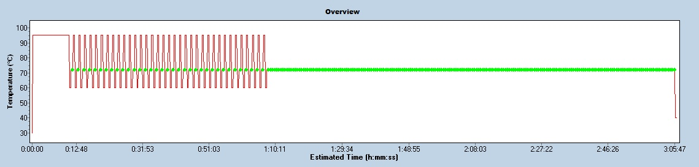

# Untergasser Data
This file and the mentioned data are part of the test data set of RDML tools ([Untergasser Data](https://github.com/RDML-consortium/rdmlpython/tree/main/experiments/untergasser)).

The Untergasser data were created by Andreas Untergasser in collaboration with Maurice van der Hoff (AMC, Amsterdam, Netherlands) and Vladimir Benes (EMBL, Heidelberg, Germany). These experiments should provide the data to optimize the algorithms of the RDML-Tools and should serve as a large technical data collection to compare different machines, reaction mixes, amplicon sizes, primer concentrations, detection methods (SYBR-Green, LC-Green, Eva-Green and hydrolysis probes) and DNA standards. Andreas Untergasser did all pipetting.

This folder contains the pipetting schemes for each run and the corresponding RDML files with the raw fluorescence data. The RDML files can be viewed with [RDML-Edit](https://www.rdml-tools.com/edit.html). The raw data can be exported as spreadsheet table in RDES format on the experiment tab. [RDML-RunAnalysis](https://www.rdml-tools.com/runanalysis.html) can analyze each run using the AmplificationCurveAnalysis tab. For convenience, an edited version combining the results of each experiment is provided as results.tsv. Additionally, the data can be analyzed by running the [python test scripts](../../test/README.md), creating analysis results files starting with temp_ and providing an overview of the results as test output. As this output is compared with the expected results, it can be used to confirm the reliability of the calculations.

## The reaction mixes used in this study
|Mix Name   |Type        | Order Information                                                            |
|-----------|------------|------------------------------------------------------------------------------|
|Roche SYBR |SYBR Green I|LightCycler 480 SYBR Green I Master from Roche (04887352001)                  |
|SensiFast  |SYBR Green I|SensiFast SYBR No-ROX Mix from bioline (CSA-01190 or BIO-98005)               |
|LCGreen    |SYBR Green I|5x LCG PCR Master from the Wittwer Lab                                        |
|Roche Probe|Probe       |LightCycler 480 Probes Master from Roche (04707494001)                        |
|IDT Probe  |Probe       |PrimeTime Gene Expression 2X Master from Integrated DNA Technologies (1055770)|
|Roche PCR  |PCR         |                          |

## The qPCR machines used in this study
|Machine Name      |Wells|Location| Machine Details                          |
|------------------|-----|--------|------------------------------------------|
|Lightcycler480    |  384|  AMC NL|LightCycler 480 II from Roche             |
|QuantStudio6Flex  |  384| EMBL DE|QuantStudio 6 Flex from applied biosystems|
|StepOne           |   96| EMBL DE|StepOne from applied biosystems           |
|Lightcycler480DKFZ|  384| DKFZ DE|LightCycler 480 II from Roche             |
|QX200             |    8| DKFZ DE|QX200 digital PCR from Roche              |

## The human genomic DNA used in this study
The human genomic DNA was ordered as Human Genomic DNA (11691112001, Roche Diagnostics GmbH, Mannheim, Germany). 

### A human genome has the size of:
|        |  GB  |  pg |
|:-------|-----:| ---:|
|male    | 6.27 | 6.41|
|female  | 6.37 | 6.51|
|both    | 6.32 | 6.46|
|haplo   | 3.16 | 3.23|

1pg == 0.978 * 10^9 bp

<pre>
 1.938ng ==  600 copies  
 4.845ng == 1500 copies  
 9.690ng == 3000 copies  
19.380ng == 6000 copies  
  
     1ng ==  309 copies  
     2ng ==  619 copies  
    20ng == 6192 copies  
</pre>
Values originate from [On the length, weight and GC content of the human genome. BMC Res Notes. 2019 Feb 27;12(1):106. doi: 10.1186/s13104-019-4137-z](https://doi.org/10.1186/s13104-019-4137-z)

## Experiment Volumes and Machines (14.02.2024, 06.03.2024)
This experiment investigates the impact of different qPCR machines and different volumes on the measured Cq, TD0 and final Ncopy numbers. Care was taken that one large volume of qPCR mix was created using primer pair FSTL-1-*-259 and spread out in different volumes on each plate. The DNA dilutions and primer dilutions were created in AMC and were frozen and transported to EMBL after the experiment "AMC Amsterdam NL - 384 Wells" on the Lightcycler480 (14.02.2024). Then identical reactions were prepared in larger volumes and pipetted from the same tube to the plates for QuantStudio6Flex and StepOne in EMBL (06.03.2024), creating the experiments "EMBL Heidelberg DE - 384 Wells" and "EMBL Heidelberg DE - 96 Wells". The pipetting schemes are available as [volume_pipett_AMC.tsv](volume_pipett_AMC.tsv) and [volume_pipett_EMBL.tsv](volume_pipett_EMBL.tsv). The raw data are stored in [volume_machine.rdml](volume_machine.rdml), the analyzed results in [volume_results.tsv](volume_results.tsv) and the Cq values called by the machines in [volume_machine_cq.tsv](volume_machine_cq.tsv).

## Experiment Primer Test (20.11.2024)
As genomic DNA should be used as a standard, the single copy gene [FSTL1](primers_FSTL1.fa) was selected as target. Then a big set of primers with probes was calculated with amplicon sizes of 50bp, 100bp, 200bp, 400bp and 800bp using [NCBI PrimerBLAST](https://www.ncbi.nlm.nih.gov/tools/primer-blast/), see file [primers_evaluated.tsv](primers_evaluated.tsv). For each amplicon size a set of 3-4 primer pairs were selected. Care was taken that one hydrolysis probe would bind to several primer pairs [primers_used.tsv](primers_used.tsv). The default primer pair from AMC was included as FSTL-1-*-259. The primers were tested on QuantStudio6Flex in EMBL, using the LightCycler 480 SYBR Green I Master Mix from Roche (04887352001) and 4ng/1200 copies human genomic DNA (11691112001, Roche Diagnostics GmbH, Mannheim, Germany). The pipetting scheme is available as [amplicon_primer_mix_pipett_primer_test.tsv](amplicon_primer_mix_pipett_primer_test.tsv). The raw data are stored as experiment "Primer Test - EMBL" in [amplicon_primer_mix.rdml](amplicon_primer_mix.rdml) and the analyzed results in [amplicon_primer_mix_results.tsv](amplicon_primer_mix_results.tsv).

## The AMC Experiments (09.12.2024 - 11.12.2024)
The following experiments were performed within three days in AMC using the Lightcycler480. Although the DNA dilutions are given in each pipetting scheme, only one DNA dilution series of human DNA was created once and was used for all the remaining experiments. During the three days in AMC, these DNA dilutions and the primers were stored at 4°C and not frozen. For the later experiments, DNAs and primers were stored at -20°C.

## Experiment Primer Concentration (09.12.2024, 10.12.2024)
This experiment evaluates the influence of the primer concentration and the reaction mix on amplification of 4ng human DNA using 100nM, 250nM and 750nM primers in combination with Roche SYBR, SensiFast and LCGreen. The pipetting schemes are available as [amplicon_primer_mix_pipett_p1_primer_conc.tsv](amplicon_primer_mix_pipett_p1_primer_conc.tsv) for Roche SYBR (09.12.2024), [amplicon_primer_mix_pipett_p2_primer_conc.tsv](amplicon_primer_mix_pipett_p2_primer_conc.tsv) for LCGreen (09.12.2024) and [amplicon_primer_mix_pipett_p5_primer_conc.tsv](amplicon_primer_mix_pipett_p5_primer_conc.tsv) for SensiFast (10.12.2024). The raw data are stored as experiment "Primer Conc - AMC" in [amplicon_primer_mix.rdml](amplicon_primer_mix.rdml) and the analyzed results in [amplicon_primer_mix_results.tsv](amplicon_primer_mix_results.tsv).

## Experiment DNA Concentration (09.12.2024 - 11.12.2024)
This experiment uses the DNA dilutions to evaluate PCR efficiency using 250nM primers in combination with Roche SYBR, SensiFast and LCGreen. The pipetting schemes are available as [amplicon_primer_mix_pipett_p3_dna_conc.tsv](amplicon_primer_mix_pipett_p3_dna_conc.tsv) for Roche SYBR (09.12.2024), [amplicon_primer_mix_pipett_p6_dna_conc.tsv](amplicon_primer_mix_pipett_p6_dna_conc.tsv) for SensiFast (10.12.2024) and [amplicon_primer_mix_pipett_p9_dna_conc.tsv](amplicon_primer_mix_pipett_p9_dna_conc.tsv) for LCGreen (11.12.2024). The raw data are stored as experiment "DNA Dilution - AMC" in [amplicon_primer_mix.rdml](amplicon_primer_mix.rdml) and the analyzed results in [amplicon_primer_mix_results.tsv](amplicon_primer_mix_results.tsv).

## Experiment Hydrolysis Probe (10.12.2024, 11.12.2024)
The first plate uses a hydrolysis probe to quantify DNA dilutions with 250nM primers and 150nM probe in combination with Roche Probe and IDT Probe master mixes (10.12.2024). The pipetting scheme is available as [probes_pipett_p4_probe_dna_conc.tsv](probes_pipett_p4_probe_dna_conc.tsv). The raw data are stored as run "P4 - Probe Mixes - DNA Dilution" in [probes.rdml](probes.rdml) and the analyzed results in [probes_results.tsv](probes_results.tsv). The second plate uses different primer and probe concentrations with 4ng human DNA and Roche Probe mix (11.12.2024). The pipetting scheme is available as [probes_pipett_p8_primer_probe_conc.tsv](probes_pipett_p8_primer_probe_conc.tsv). The raw data are stored as run "P8 - Primer conc - Probe conc" in [probes.rdml](probes.rdml) and the analyzed results in [probes_results.tsv](probes_results.tsv).

## Experiment SYBR Green I Concentration (09.12.2024 - 11.12.2024)
Initially, SYBR Green I was added to regular reactions with the Roche SYBR and SensiFast mix. The additional reactions were added to the plates of the experiment for DNA concentration. The pipetting schemes are available as [amplicon_primer_mix_pipett_p3_dna_conc.tsv](amplicon_primer_mix_pipett_p3_dna_conc.tsv) for Roche SYBR (09.12.2024) and [amplicon_primer_mix_pipett_p6_dna_conc.tsv](amplicon_primer_mix_pipett_p6_dna_conc.tsv) for SensiFast (10.12.2024). The raw data are stored as experiment "Add SYBR - AMC" in [sybr_conc.rdml](sybr_conc.rdml) and the analyzed results in [sybr_conc_results.tsv](sybr_conc_results.tsv). Then dilutions of SYBR Green I were added to Roche Probe mix using 100nM, 250nM and 750nM primers (11.12.2024). The pipetting scheme is available as [sybr_conc_pipett_p7_probe_mix.tsv](sybr_conc_pipett_p7_probe_mix.tsv). The raw data are stored as experiment "Probe Mix SYBR" in [sybr_conc.rdml](sybr_conc.rdml) and the analyzed results in [sybr_conc_results.tsv](sybr_conc_results.tsv).

## The EMBL Experiments (19.02.2025 - )
The remaining experiments were performed in EMBL using the QuantStudio6Flex if not indicated else. The DNA dilution series of human DNA prepared in AMC was used for all the remaining experiments and was stored at -20°C between experiments.

## Experiment DNA Dilutions (19.02.2025)
Genomic DNA quantification with different methods resulted in slightly different. Therefore we isolated human genomic DNA from saliva and blood samples using the Monarch Spin gDNA Extraction Kit from NEB (T3010S) and the commercial DNA and compared the isolates on NanoDrop, QBit 4 and qPCR. The results show differences up to factor 2 [large_DNA_dilutions_quantify.tsv](large_DNA_dilutions_quantify.tsv). Additionally we created a dilution standard using two purified PCR amplicons, both added to the standard in 10^9 copies per µl. The 1:10 Dil was diluted by subsequent 1:10 dilution steps while the Dil BSG was diluted in bigger steps. The pipetting scheme of the qPCR is available as [large_DNA_dilutions_pipett_genomic_dna.tsv](large_DNA_dilutions_pipett_genomic_dna.tsv). The raw data are stored as experiment "DNA Dilutions - EMBL" in [large_DNA_dilutions.rdml](large_DNA_dilutions.rdml) and the analyzed results in [large_DNA_dilutions_results.tsv](large_DNA_dilutions_results.tsv).

## Experiment Creating an Own qPCR Mix (26.03.2025, 02.04.2025)
Commercial qPCR mixes do not provide the SYBR concentration an slightly differ in their results calculating Ncopy. Therefore a defined qPCR mix should be created using the FastStart Taq DNA Polymerase kit from Roche (04738314001) and the SYBR Green I from ABP Biosciences (D010). As concentrations in the previous experiments were to high, SYBR green was used in 0.25x concentration. In the first run the influence of Mg and DMSO was tested (26.03.2025). The pipetting scheme is available as [own_mix_a_pipett_mg_dmso.tsv](own_mix_a_pipett_mg_dmso.tsv), the raw data are stored in [own_mix_a.rdml](own_mix_a.rdml) and the results from the dPCR are available as [own_mix_a_results.tsv](own_mix_a_results.tsv).

The decision was made to use 3.0mM Mg and no DMSO. The second run tested the presence of BSA and different SYBR Green concentrations (02.04.2025). The pipetting scheme is available as [own_mix_b_pipett_sybr_conc.tsv](own_mix_b_pipett_sybr_conc.tsv), the raw data are stored in [own_mix_b.rdml](own_mix_b.rdml) and the results from the dPCR are available as [own_mix_b_results.tsv](own_mix_b_results.tsv).

The decision was made to use 0.25x SYBR Green which should correspond to 250nM (see the SYBR mystery below). The third run tested the primer concentrations with different amplicons (02.04.2025). The own mix gives less stable results, but works in principle. The pipetting scheme is available as [own_mix_c_pipett_primer_conc.tsv](own_mix_c_pipett_primer_conc.tsv), the raw data are stored in [own_mix_c.rdml](own_mix_c.rdml) and the results from the dPCR are available as [own_mix_c_results.tsv](own_mix_c_results.tsv).

## Experiment Unused Comparison qPCR with dPCR (30.05.2025)
A first attempt was made to compare qPCR with dPCR in EMBL. The dPCR failed due to outdated chemicals, but the qPCR worked well. Although it is not used in any test or analysis, we provide the data. The pipetting scheme of the qPCR is available as [unused_qpcr_dpcr_comparison_pipett.tsv](unused_qpcr_dpcr_comparison_pipett.tsv) and the raw data in [unused_qpcr_dpcr_comparison.rdml](unused_qpcr_dpcr_comparison.rdml).

## Experiment Quantify Standard by dPCR (27.08.2025)
As PCR efficiency and TD0 calculation contribute in Ncopy calculation, a qPCR and a dPCR were prepared on the same DNA samples. In the qPCR a new 1:10 dilution series was prepared and aliquoted. The "freeze" aliquots were frozen and thawed for 10 times evaluate the impact on the DNA (27.08.2025). The pipetting scheme of the qPCR is available as [large_DNA_dilutions_pipett_qpcr_for_dpcr.tsv](large_DNA_dilutions_pipett_qpcr_for_dpcr.tsv), the raw data are stored as experiment "dPCR - DKFZ" in [large_DNA_dilutions.rdml](large_DNA_dilutions.rdml) and the analyzed results in [large_DNA_dilutions_results.tsv](large_DNA_dilutions_results.tsv). The pipetting scheme of the dPCR is available as [large_DNA_dilutions_pipett_dpcr.tsv](large_DNA_dilutions_pipett_dpcr.tsv). The results from the dPCR using probes are available as [large_DNA_dilutions_res_dpcr_probe.tsv](large_DNA_dilutions_res_dpcr_probe.tsv) and using Eva Green as [large_DNA_dilutions_res_dpcr_evagreen.tsv](large_DNA_dilutions_res_dpcr_evagreen.tsv).

This experiment was run on DKFZ on the Lightcycler480DKFZ for the qPCR and the QX200 for dPCR.

## Experiment Eva Green Concentration (17.09.2025)
As Eva Green is used in dPCR, we decided to repeat the primer and DNA dilutions experiments with the probe mixes and add Eva Green. In the first run we tested in a small set different Eva Green concentrations with the different probe mixes (17.09.2025). The pipetting scheme is available as [eva_green_a_pipett.tsv](eva_green_a_pipett.tsv), the raw data are stored in [eva_green_a.rdml](eva_green_a.rdml) and the results from the dPCR are available as [eva_green_a_results.tsv](eva_green_a_results.tsv).

In the second run we tested different Eva Green concentration with 100mM and 250mM primers in the Roche probe mixes (17.09.2025). The pipetting scheme is available as [eva_green_b_pipett.tsv](eva_green_b_pipett.tsv), the raw data are stored in [eva_green_b.rdml](eva_green_b.rdml) and the results from the dPCR are available as [eva_green_b_results.tsv](eva_green_b_results.tsv).

## Experiment Different Fluorescence Reporters (22.10.2025)
The Roche probe mix can be complemented with any reporter. Therefore, we used within one run a hydrolysis probe, Eva Green or SYBR Green I. The pipetting scheme is available as [quantification_methods_pipett.tsv](quantification_methods_pipett.tsv), the raw data are stored in [quantification_methods.rdml](quantification_methods.rdml) and the results from the dPCR are available as [quantification_methods_results.tsv](quantification_methods_results.tsv).

# Experiment The SYBR Green Mystery (17.04.2025, 17.09.2025)
SYBR Green I is available in a 10000x solution from Sigma-Aldrich (S9430), which does not provide a concentration. The SBYR Green I used in this study is a 200x solution with a concentration of 200µM from ABP Biosciences (D010). Furthermore, there is a SYBR Green I available in 11x solution and 110µM concentration from Carl Roth (1CN2.1). The concentrations of ABP Biosciences and Carl Roth differ, as ABP Biosciences uses an ε of 66000M⁻¹cm⁻¹and Carl Roth and ε of 27000M⁻¹cm⁻¹ to calculate the concentration by Beer-Lambert law (A = ε·c·l). Be aware that spectrometers use l=1cm while the NanoDrop uses l=0.1cm. We diluted the stock from Sigma-Aldrich 50 times in DMSO to get a comparable 200x stock and measured all stock solutions including Eva Green with a NanoDrop. We follow the argumentation by [Mao et al. page 13 BMC Biotech.2007; 7:76.](http://www.biomedcentral.com/1472-6750/7/76) and use an ε of 58000M⁻¹cm⁻¹ in all our calculations to convert absorbance to concentration, then a concentration c of 200µM SYBR Green I concentration results in an absorbance A of 11.6. In the experiments the stock solution of ABP Biosciences was used as 200µM.

|Stock          |nm |A    |
|---------------|---|-----|
|Sigma-Aldrich  |494|1.196|
|ABP Biosciences|494|1.242|

|Stock          |nm |A    |
|---------------|---|-----|
|ABP Biosciences|495|1.235|
|Carl Roth      |495|0.309|
|EvaGreen       |495|0.131|

## Experiment SYBR Stability (28.11.2025)
This experiment investigates how stable SYBR Green I is in the qPCR machine at 72°C over time. Furtehrmore, it gives an indication how the measurements of the same reaction vary. The experiment runs a relgular qPCR for 35 cycles and then keeps the mix at 72°C without cycling and measures fluorescence every 30 seconds. Green dots are fluorescence measurements.  

The pipetting scheme of the qPCR is available as [sybr_stability_pipett.tsv](sybr_stability_pipett.tsv), the raw data are stored as experiment "dPCR - DKFZ" in [sybr_stability.rdml](sybr_stability.rdml) and the analyzed results in [sybr_stability_results.tsv](sybr_stability_results.tsv). In general, the SYBR Green one is stable over time and the machine has a measurement CV around 0.002-0.004.
